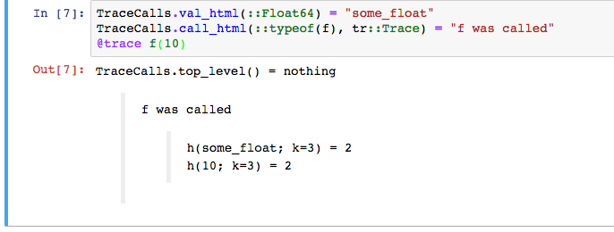

# TraceCalls

`TraceCalls` is a debugging tool for understanding program execution, similar to Common
Lisp's `TRACE`. `@traceable` augments a function's code to store its calling information
(but see [this note on performance](README.md#Performance)), then `@trace` returns
the call-tree of all `@traceable` functions that are called within its scope. For example:

The return value of `@trace` is a `Trace` object, which is displayed nicely in
HTML-capable environments. Try `dumps(trace)` to see how the data is stored, or to perform
extra analysis.

#### Filtering

`filter_trace(func, trace::Trace)` applies `func` to every sub-trace, and eliminates
those for which `func(sub_trace) === false`. For example, `filter_trace(x->x.func===h
&& x.args[1] < 6, tr)` keeps only calls to `h` where the first argument is less than 6.

##### Limiting depth

`limit_depth(::Trace, n::Int)` prunes the Trace-tree to a depth of `n` (convenient
to first explore a trace at a high-level).

#### Custom printing

When working with large objects, traces can become unwieldy. Custom printing can be
achieved by overloading either `Base.show`, or `TraceCalls.val_html` and
`TraceCalls.call_html`:

#### Performance

The `@traceable` macro should have minimal impact on performance when `@trace` isn't
used, and no impact on type-stability. Nevertheless, you can disable tracing entirely by
typing `import TraceCalls; TraceCalls.active[] = false` _at the beginning of your Julia
session_, or at the start of your script. This disables the `@traceable` macro entirely.